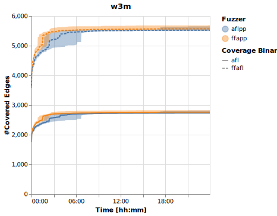

# Artifact Evaluation
This repository contains several experiments that we conducted to evaluate the [artifact](https://github.com/HexHive/FishFuzz/tree/3354216bb1bdd8c63d466115b73a51edd2505fe6) of [FishFuzz (paper)](https://www.usenix.org/conference/usenixsecurity23/presentation/zheng).

## Conducted Experiment(s)
As part of a larger effort to reproduce fuzzing research, we have selected FishFuzz for reproduction. In the following, we outline the experiment(s) we conducted to evaluate FishFuzz and the claims the paper makes. We first thoroughly study the artifact and paper and then design a number of experiments to test the core claims of the paper.

### [01-Coverage-Computation](./01-Coverage-Computation)
After initially including FishFuzz in FuzzBench and noticing its coverage does not live up to our expectations, we analyzed the artifact in-depth to understand why. During this process, we noticed FishFuzz measures coverage as follows: They use `afl-showmap` on a binary containing AFL coverage instrumentation and additional instrumentation that is only available to FishFuzz during fuzzing.

This introduces a bias into the evaluation. More specifically, this adds edges to the binary (the instrumentation) that only FishFuzz can trigger during fuzzing (as AFL's binary does not contain them). To visualize this, assume some input covering one specific edge of this additional instrumentation is found both by FishFuzz and AFL. Then, FishFuzz would keep this input (as it exercises new coverage), while AFL would discard the input (the edge, where the new coverage would be exercised, does not exist in AFL's binary; the input simply takes some other path, which may or may not exercise new coverage). Notably, because AFL discards the input, it is also not available during coverage computation (which is done over the queue). Thus, no coverage is attributed to AFL for this specific edge/branch, even though it was covered during fuzzing.

Additionally, we found a secondary issue skewing coverage results: AFL's instrumentation is prone to collisions, where edges are discarded even though they triggered new coverage. While this should influence both FishFuzz and AFL (as both use a bitmap prone to collisions), the resulting coverage may not represent the *real* coverage achieved during fuzzing. In the following, we focus on the first issue, as collisions in the bitmap have already been explored by other works [1].

To showcase the impact of measuring coverage on an instrumented binary, we execute the paper's two-stage experiment (Table 5 in the paper) for all seven targets and four fuzzers (the other fuzzers evaluated against in the paper are not provided alongside the artifact).

For your convenience, these are the results as reported by the paper:

After running each target ten times for 24 hours as outlined in the paper, we compute coverage in *two* different ways:
    1. The same way as in the paper, using the provided script of the paper's artifact. This measures coverage on the AFL binaries containing FishFuzz' instrumentation.
    2. An AFL binary that does *not* contain any additional instrumentation, which would be known by only a subset of fuzzers.

> Please note that this experiment is only done for reproducibility purposes, and we do not recommend using coverage measurement tools that are subject to collisions.

We list the results of our two types of coverage measurements below. The shaded area in the plots shows the 100% interval, i.e., all of the ten runs are within this area. The "Coverage Binary" legend refers to the plain AFL coverage as *afl* and to the FishFuzz-specific coverage as *ffafl*. For the Fuzzers legend, we abbreviate as follows:
- *afl*: AFL (v2.57b) as provided by the artifact.
- *ffafl*: AFL (2.57b) extended with the FishFuzz approach, as provided by the artifact.
- *aflpp*: AFL++ (4.00c) as provided by the artifact.
- *ffapp*: AFL++ (4.00c) extended with the FishFuzz approach, as provided by the artifact.

We first provide the plots comparing FishFuzz++ (ffapp) against its baseline AFL++ and below FishFuzz (ffafl) vs the baseline AFL.

#### AFL++ (aflpp) versus FishFuzz++ (ffapp)

 

#### AFL (afl) versus FishFuzz (ffafl)

 

### Interpretation of Results

Since the AFL vanilla binaries do not contain additional instrumentation, the number of covered edges is significantly lower than for the FishFuzzAFL binaries.
Particularly interesting are the results for `cxxfilt` and `tic`, where FishFuzz++'s improvement (averaged over all ten runs) over the baseline (AFL++) is reduced from 8.44% to 1.69% and from 6.16% to 2.04%, respectively.
Overall, the coverage increase from FishFuzz to AFL is 65.70% lower, and the increase from FishFuzz++ to AFL++ is 51.85% lower.

This demonstrates the importance of using a binary for coverage computation that does not contain any other instrumentation. Please note that both types of coverage computation are still subject to collisions and should not be used for comparison.

----

[1] Stephan Lipp, Daniel Elsner, Thomas Hutzelmann, Sebastian Banescu, Alexander Pretschner, and Marcel Böhme. "FuzzTastic: A Fine-grained, Fuzzer-agnostic Coverage Analyzer", ACM/IEEE 44th International Conference on Software Engineering: Companion Proceedings, 2022
